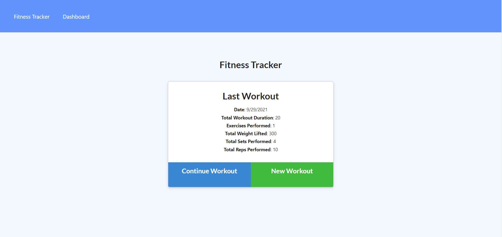

# Fitness Tracker
## UofO Coding Bootcamp Homework for Week 18

### The function of this app is to be able to view create and track daily workouts. With this app, you can log multiple exercises in a workout on a given day and track the name, type, weight, sets, reps, duration, and, if it's cardio, distance of the exercise.

### A live example can be accessed [here.](https://mongo-db-fitness-tracker.herokuapp.com/)
 

> **1920p width screen example.**   

> **Note: Appearance will change based on screen resolution.** 